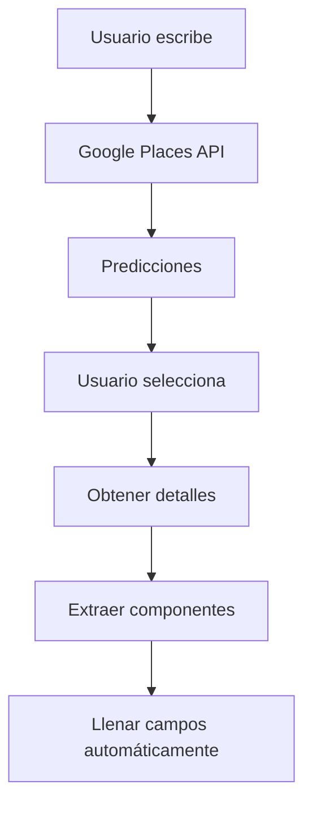

# 🗺️ Integración de Google Places API

## 📋 **Descripción General**

Se ha integrado Google Places API para mejorar la experiencia de edición de propiedades, permitiendo búsqueda automática de direcciones y extracción automática de componentes de dirección.

## 🎯 **Características Implementadas**

### **1. Autocompletado de Direcciones**
- ✅ **Búsqueda en tiempo real** - Predicciones mientras escribes
- ✅ **Restricción a España** - Resultados limitados a España
- ✅ **Navegación con teclado** - Flechas, Enter, Escape
- ✅ **Cierre automático** - Al hacer clic fuera del dropdown
- ✅ **Indicador de carga** - Spinner mientras busca

### **2. Extracción Automática de Datos**
- ✅ **Dirección completa** - Calle y número
- ✅ **Ciudad** - Localidad
- ✅ **Provincia** - Comunidad autónoma
- ✅ **Código postal** - Código postal
- ✅ **País** - País (normalmente España)
- ✅ **Coordenadas** - Latitud y longitud

### **3. Interfaz Mejorada**
- ✅ **Campos automáticos** - Se llenan al seleccionar lugar
- ✅ **Visualización de coordenadas** - Muestra lat/lng
- ✅ **Estilo diferenciado** - Sección azul para campos automáticos
- ✅ **Edición manual** - Los campos se pueden editar manualmente

## 🔧 **Componentes Creados**

### **1. GooglePlacesAutocomplete**
```typescript
// Ubicación: src/components/common/GooglePlacesAutocomplete.tsx
// Funcionalidad: Autocompletado de direcciones con Google Places API
```

**Características:**
- Carga automática de Google Places API
- Predicciones en tiempo real
- Navegación con teclado
- Extracción de detalles de lugar
- Manejo de errores robusto

### **2. GooglePlacesTest**
```typescript
// Ubicación: src/components/GooglePlacesTest.tsx
// Ruta: /google-places-test
// Funcionalidad: Componente de prueba para verificar la API
```

**Características:**
- Prueba completa de la API
- Visualización de datos extraídos
- Instrucciones de uso
- Verificaciones de configuración

### **3. Tipos TypeScript**
```typescript
// Ubicación: src/types/google-maps.d.ts
// Funcionalidad: Declaraciones de tipos para Google Maps API
```

## 🚀 **Cómo Usar**

### **1. En el Formulario de Propiedades**
1. Ve a `/properties`
2. Haz clic en "Editar" en cualquier propiedad
3. En el campo "Ubicación", escribe una dirección
4. Selecciona una opción del dropdown
5. Los campos de dirección se llenarán automáticamente

### **2. Probar la API**
1. Ve a `/google-places-test`
2. Escribe una dirección para probar
3. Selecciona una opción
4. Verifica que los datos se extraigan correctamente

## ⚙️ **Configuración Requerida**

### **1. Variable de Entorno**
```env
VITE_GOOGLE_MAPS_API_KEY=tu_clave_de_google_maps_aqui
```

### **2. Permisos de API**
La API key debe tener habilitados:
- ✅ **Places API**
- ✅ **Geocoding API** (opcional, para funcionalidad adicional)

### **3. Restricciones**
- 🔒 **Restricción por país**: Solo España
- 🔒 **Tipos de lugar**: Geocoding y establecimientos
- 🔒 **Límite de caracteres**: Mínimo 3 para activar búsqueda

## 📊 **Flujo de Datos**



## 🔍 **Debugging**

### **1. Verificar API Key**
```javascript
// En la consola del navegador
console.log('API Key configurada:', !!import.meta.env.VITE_GOOGLE_MAPS_API_KEY);
```

### **2. Verificar Carga de API**
```javascript
// En la consola del navegador
console.log('Google Places cargado:', !!window.google?.maps?.places);
```

### **3. Errores Comunes**
- ❌ **"Google Places API not loaded"** - API key incorrecta o sin permisos
- ❌ **"REQUEST_DENIED"** - API key sin permisos para Places API
- ❌ **"OVER_QUERY_LIMIT"** - Límite de consultas excedido

## 🎨 **Personalización**

### **1. Cambiar País**
```typescript
// En GooglePlacesAutocomplete.tsx
componentRestrictions: { country: 'es' } // Cambiar 'es' por otro código
```

### **2. Cambiar Tipos de Lugar**
```typescript
// En GooglePlacesAutocomplete.tsx
types: ['geocode', 'establishment'] // Agregar/quitar tipos
```

### **3. Personalizar Estilos**
```typescript
// En SimplePropertyForm.tsx
// Modificar las clases CSS de la sección de campos automáticos
```

## 📈 **Próximas Mejoras**

### **1. Funcionalidades Adicionales**
- 🗺️ **Mapa interactivo** - Mostrar ubicación en mapa
- 📍 **Marcador de posición** - Pin en el mapa
- 🔄 **Geocodificación inversa** - Obtener dirección desde coordenadas

### **2. Optimizaciones**
- ⚡ **Debounce** - Reducir llamadas a la API
- 💾 **Cache local** - Guardar resultados recientes
- 🎯 **Búsqueda más inteligente** - Mejorar predicciones

### **3. Integración Avanzada**
- 📊 **Análisis de ubicación** - Información del barrio
- 🚇 **Transporte público** - Cercanía a estaciones
- 🏪 **Puntos de interés** - Restaurantes, tiendas cercanas

## ✅ **Estado Actual**

- ✅ **Autocompletado funcional**
- ✅ **Extracción de datos**
- ✅ **Interfaz integrada**
- ✅ **Componente de prueba**
- ✅ **Documentación completa**
- ✅ **Tipos TypeScript**

¡La integración de Google Places está lista para usar! 🎉 